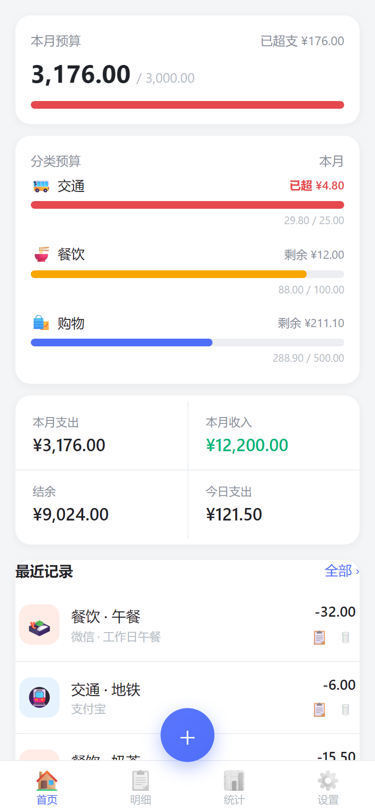
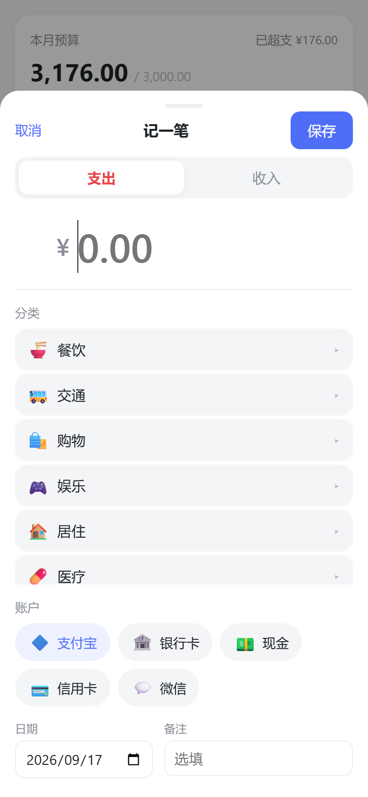
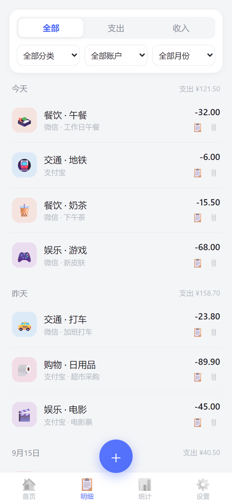
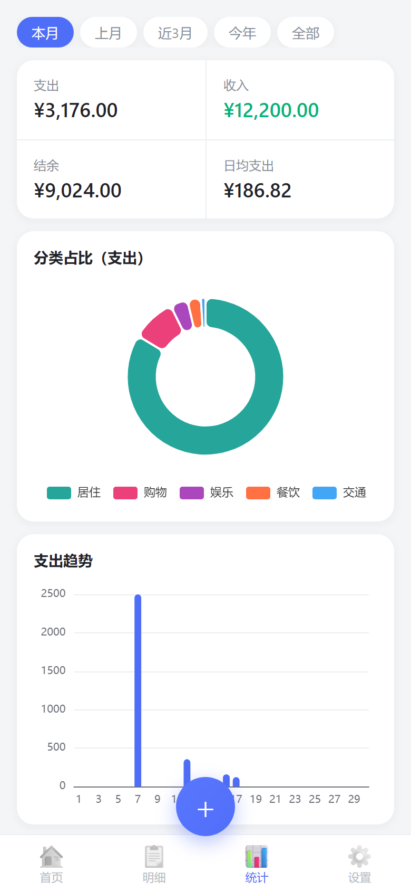

# 记账本 📒

> 跑在手机浏览器里的**本地记账 App**：单式记账、收支都记、两级分类、预算红线、图表报表。数据全部存在本机（IndexedDB），**不上传任何服务器**。

**在线使用**：<https://fcyzjbn.github.io/ledger/>

---

## 📱 手机上 3 步装好

1. 手机浏览器打开 <https://fcyzjbn.github.io/ledger/>
2. 右上角菜单 → **「添加到主屏幕」**（Chrome/Edge 都支持）
3. 桌面点开「记账本」图标，即可像 App 一样**全屏、离线**使用

---

## ✨ 功能

- **记一笔**：3 秒完成，默认今天日期、大金额键盘、常用分类、账户标签、选填备注。
- **两级分类**：预置 9 大支出类 + 5 大收入类及常用子类；图标一键点选、颜色、归属都可自定义。
- **账户标签**：微信 / 支付宝 / 现金 / 银行卡 / 信用卡，可自定义。
- **预算红线**：设每月总支出上限，用掉 80% 进度条变黄、超支变红（只提醒、不拦截）。
- **分类预算**：可给餐饮、居住等单个支出大类单独设预算，只设你在意的几个；记账刚好花超时当场轻提示，不打断记账。
- **统计报表**：本月 / 上月 / 近 3 月 / 今年 / 全部 的收支结余、日均支出、分类占比环形图、支出趋势柱状图。
- **明细**：按日期分组，支持类型 / 分类 / 账户 / 月份筛选，可编辑、复制、删除。
- **数据安全**：JSON 全量备份与恢复、CSV 明细导出（Excel 可直接打开）。

## 📷 截图

<p align="center">
  
  
  
  
</p>

> 截图含示例数据，仅作演示效果。

---

## 📖 使用说明

- **记一笔**：点底部 ➕，输入金额 → 选分类 → 选账户 → 保存（日期默认今天，可改）。
- **分类与账户**：设置 → 分类管理 / 账户管理，可增删改；大类下还能建子类，图标点选、也可自定义 emoji。
- **预算**：设置 → 每月支出预算帽，保存后首页显示进度条。
- **分类预算**：设置 → 分类预算，给支出大类逐个填金额（留空=不设），保存后首页出现「分类预算」卡，按超支程度排序。
- **备份与恢复**：设置 → 导出备份（JSON）下载文件；换手机或清理浏览器数据前务必先备份，再到新设备导入即可恢复。

## 🔒 数据安全

- 数据存在**本机浏览器**（IndexedDB），无账号、无云端、无追踪。
- 清理浏览器数据会清空记账，请定期用「设置 → 导出备份（JSON）」保存到网盘 / 电脑作为唯一安全网。

---

## 🛠 面向开发者

纯原生实现，无构建步骤：**JS ES Module**（无框架）+ **IndexedDB**（本地存储）+ **ECharts**（图表，本地打包）+ **PWA**（Service Worker + manifest，可离线）。

### 目录结构

```
├── index.html              入口页
├── manifest.json           PWA 清单
├── sw.js                   Service Worker（离线缓存）
├── css/style.css           样式
├── js/
│   ├── app.js              主逻辑（视图 / 记账 / 明细 / 统计 / 设置 / 导入导出）
│   ├── db.js               IndexedDB 封装
│   ├── seed.js             默认分类 / 账户
│   ├── charts.js           ECharts 图表封装
│   └── util.js             工具函数
├── vendor/echarts.min.js   本地图表库
├── icons/                  App 图标
├── docs/screenshots/       README 截图
├── scripts/
│   ├── serve.js            本地静态服务（正确 MIME）
│   ├── smoke.mjs           CDP 冒烟测试
│   ├── screenshot.mjs      生成 README 截图
│   └── generate_icons.py   图标生成脚本
└── LICENSE                 MIT
```

### 本地运行

本项目使用 ES Module，需通过 http 服务（并保证 `.js` 返回正确 MIME）：

```bash
node scripts/serve.js        # 默认 http://localhost:8000
# 或
npx serve .
```

> 注意：`file://` 直接打开可正常记账，但「添加到主屏 + 离线」需要 https/localhost。Windows 上 `python -m http.server` 会把 `.js` 当 `text/plain` 返回，导致 ES 模块加载失败，不建议用它测试本项目。

### 部署到 GitHub Pages

1. 新建 GitHub 仓库，推送本目录。
2. 仓库 `Settings → Pages`，Source 选 `main` 分支根目录，保存。
3. 得到网址如 `https://你的用户名.github.io/仓库名/`。
4. 手机 Chrome/Edge 打开该网址 → 菜单 →「添加到主屏幕」。

### 测试

```bash
node scripts/serve.js          # 先起本地服务
node scripts/smoke.mjs         # 端到端冒烟（渲染 / 记一笔 / 明细 / 统计 / 关于 / 图标面板）
node scripts/screenshot.mjs    # 重新生成 README 截图（需本地服务已起）
```

---

## 📄 License

[MIT](LICENSE)
